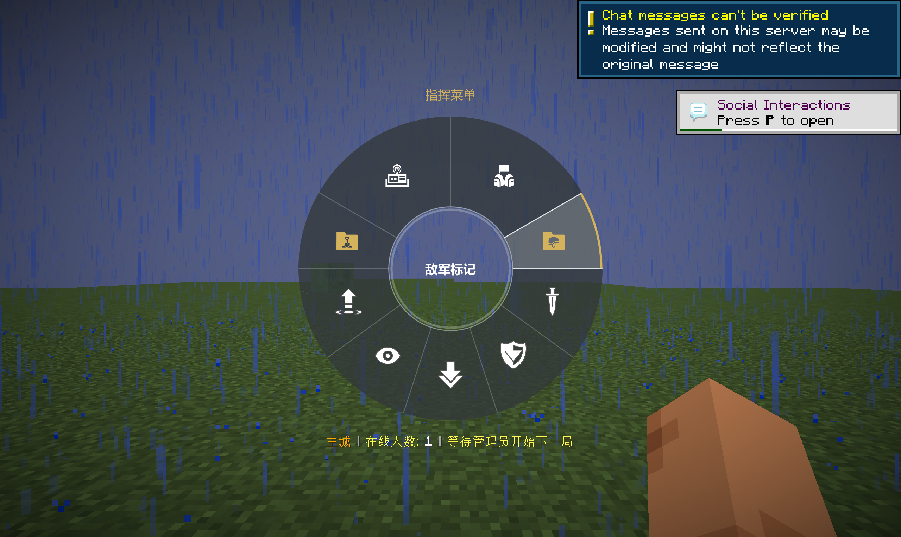
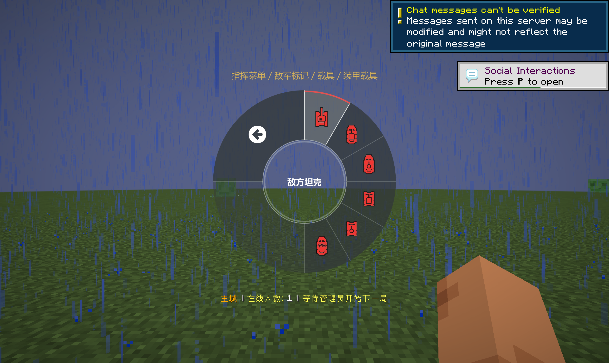
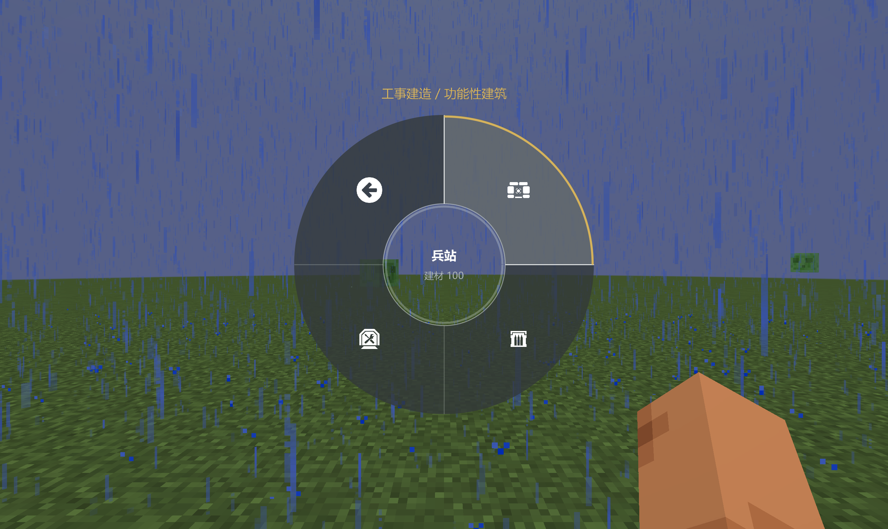
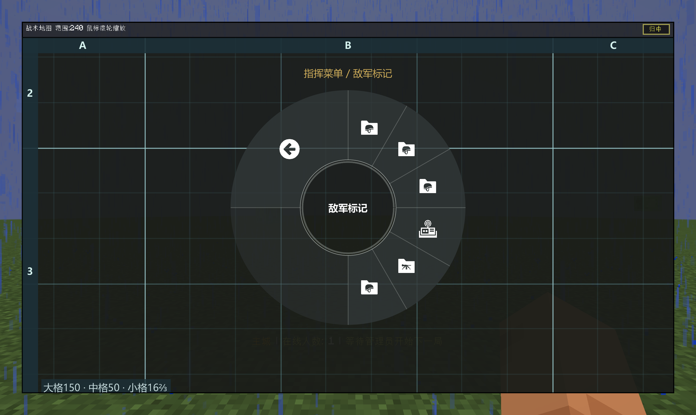

# 时钟轮盘排版更新 · 2026-10-11

EsRadial 0.3.2 / EsPoints 1.1.1e / Espetro 1.1.3-l，继续使用 ApricityUI 1.2.6。

## 更新大纲

1. 默认以 30° 时钟刻度安排按钮，可合并扇区，不固定预留 12 个槽。
2. 按钮只显示图标；悬停名称与业务说明放在中心，使用较小的平滑字体。移除通用操作提示。
3. 主页：队包 12–2 点、电台 10–12 点、敌军标记 2–3 点、工事 9–10 点；两个分类入口为黄色。五种战术标点均分 3–9 点，移除请求弹药与请求建材。
4. 工事：功能性建筑、防御工事、武器各占 1/4，返回占 9–12 点。功能性建筑只有兵站、弹药箱、维修站，各占 1/4。
5. 敌军及普通子页从 12 点开始每项 30°，空白仅留在尾部。返回通常占 9–12 点；10 项时缩为 60°，11 项时缩为 30°，更多内容通过分组页面进入。地图轮盘遵循相同规则。
6. 返回是普通轮盘扇区，不再是独立中心按钮；右键不导航。保留 F6 编辑、30°/45° 吸附及配置文件调整。旧自定义布局保留，需要时可重置当前页。

[设计与实机截图 PDF](ES系列-时钟轮盘更新与设计图.pdf)

## 验证与交付

- EsRadial 52 项、EsPoints 23 项、Espetro 接入与分类 15 项测试通过。
- 独立 Minecraft 1.20.1 / Forge 47.4.26 实机验证：树状导航、扇区返回、右键无导航、中心名称与说明、原生像素画布、F6 编辑保存/取消/重置/配置读取、自动 GUI 比例与地图轮盘生命周期。
- PNG 为 2560×1528 实机原图；PDF 包含矢量设计示意和实机截图。
- [Espetro PR #12](https://github.com/KaguyaMao/Espetro/pull/12)：基于 1.20.1。
- [EsPoints PR #2](https://github.com/KaguyaMao/EsPoints/pull/2)。两个 PR 描述均保持为空。

## 构建范围

已合入 Espetro 1.20.1 上游补交的 FixedWeapon 源码，FixedWeaponWheelPacket 缺失已解决。最新完整上游源码仍缺 DragonRise 的 SupplyStationConfig / SupplyStationDataLoader，完整编译未通过。

EsRadial 与 EsPoints 测试 jar 由本次完整源码构建；Espetro 测试 jar 使用此前可编译的完整底包，接入本次轮盘改动。该包用于本地测试，不代表最新上游完整发行包。更新后需要完整重启客户端。
