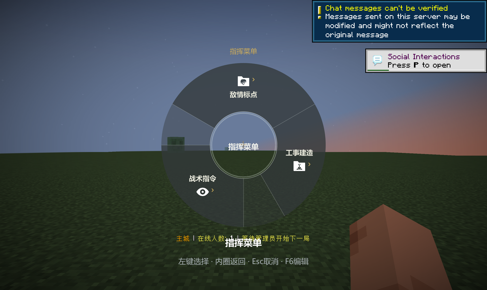
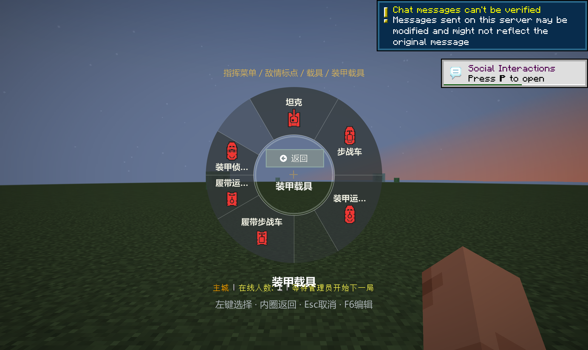
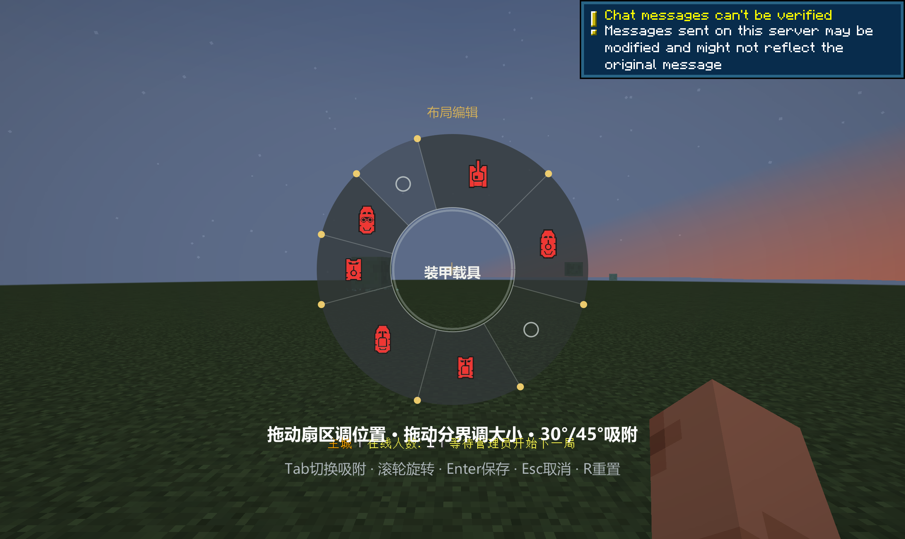
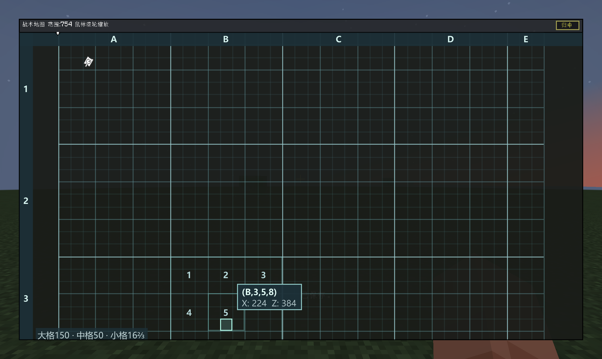
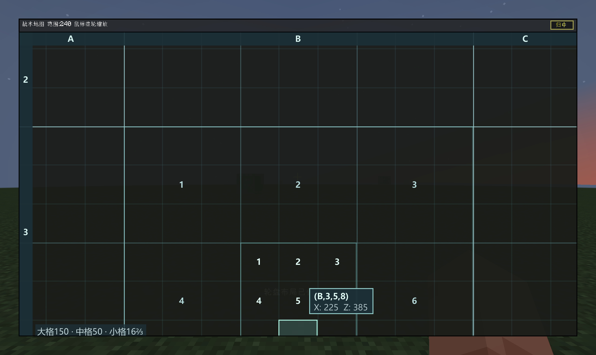
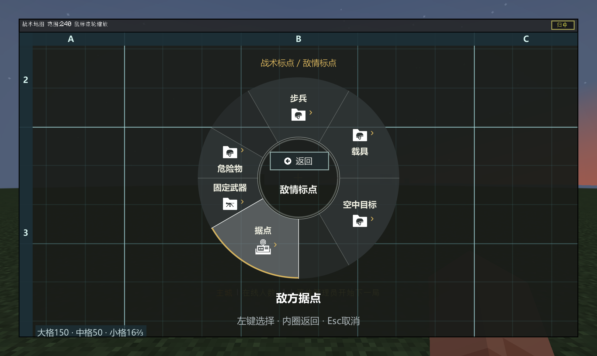
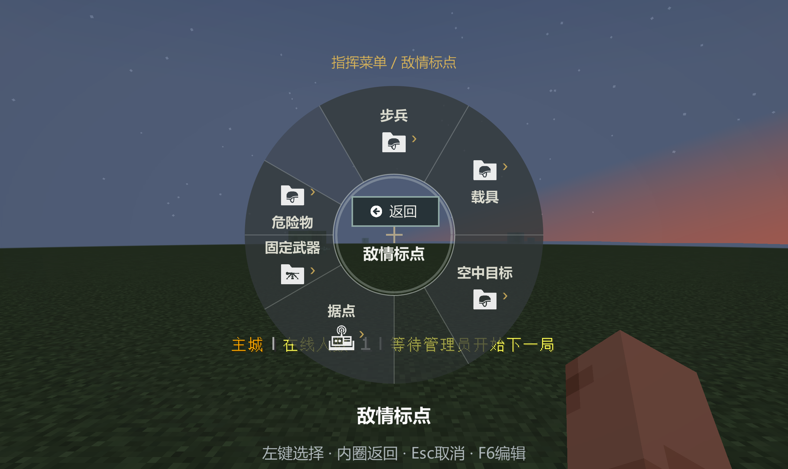

# ES 系列本次更新总结大纲

日期：2026-10-11。范围：本次轮盘、分类、地图及界面修复的全部累计更新。

**配套版本：EsRadial 0.3.1 / EsPoints 1.1.1d / Espetro 1.1.3-k。**
运行环境：Forge 1.20.1、Java 17、ApricityUI 1.2.6、PingWheel 1.12.1。

[完整 PDF：更新总结、设计图与实机配图](ES系列-本次更新总结与设计图.pdf)

## 1. 新增 EsRadial 通用轮盘库

- 使用 ApricityUI 统一绘制圆环、图标、文字和进度，管理鼠标、按键会话和导航。
- Espetro 的建造、技能、职业、补给、载具，以及 EsPoints 标点共用；各模组保留业务与服务端校验。
- 轮盘外观参考 Squad；图标使用提供的 UI / mark 素材。

## 2. 统一入口与树状分类

- 敌情标点、战术指令、工事建造共用入口，点击分类逐层进入。
- 敌情分为步兵、载具、空中目标、据点、固定武器和危险物；载具再分装甲、轻型、后勤与支援。
- 战术指令分行动，以及补给与接送。工事按基础、防御、固定武器、后勤和其他分类，内容取自真实服务端目录。
- 标点共 43 种类型；普通分类轮盘提供 42 种，155 炮击点继续用专用入口。EsPoints 每个目录最多 6 项。

## 3. 扇区、空槽与两种自定义方式

- 不等大小扇区，保留空白；空槽不执行动作，缺项不必重新均分。
- F6 进入编辑；拖动扇区或空槽调整顺序，拖动分界线调整大小，滚轮旋转。
- Tab 切换 30°/45°混合、30°、45°、自由；混合模式不是所有 15°倍数。
- Enter 保存，Esc 取消，R 恢复默认后 Enter 保存。编辑预览不执行游戏动作。
- 手动调整客户端 `config/esradial/layouts.json`，下次打开读取；每页与每个选项集合独立保存。
- `start` 改位置、`sweep` 改大小、`slot: null` 表示空槽；非法配置回退默认且不覆盖坏文件。

## 4. 地图标点与己方载具

- 地图使用 mark 素材：白色己方载具、红色人工敌情；战术指令保留动作颜色。
- 地图右键空白打开分类轮盘，标点固定最初点击位置；世界标点固定最初瞄准位置。
- 己方地图订阅者每 10 tick 接收载具位置、朝向、乘员、小队信息。
- 未加载载具最后位置淡显，销毁或过期取消显示；未知类型采用通用图标。
- 不自动透露敌方载具。保留标点权限、边界、距离、冷却、删除和炮击选点逻辑。

## 5. 固定地图网格与四级坐标

- 大格固定 150×150 方块，横坐标 A…Z、AA…，纵坐标 1、2、3…。
- 大格分 3×3 中格，边长 50；中格再分 3×3 小格，边长精确为 50/3。
- 中格和小格都从左到右、从上到下编号 1-9。
- 地图 minX / minZ 与 `(A,1,1,1)` 左上角对齐；X 向右、Z 向下，按固定尺寸延伸。
- 缩放、平移不改变原点或编号；残格裁切，远景隐藏过密细线，不按地图大小缩放格子。
- 上边字母标尺、左边数字标尺；悬停显示 `(大格字母,大格数字,中格数字,小格数字)`，并高亮当前格。
- 提示框、局部编号限制在地图内，避免文字重叠。相对原点 `(225,385)` 对应 `(B,3,5,8)`。

## 6. 最终返回位置、字体与清晰度

- 返回放入中心圆上半部，分类名称在下半部；点击返回退一层，轮盘内右键不导航、不关闭。
- 左键确认，Esc 或松开唤出键取消；不可用项显示原因。
- ApricityUI 平滑字体优先读取系统微软雅黑；圆环按屏幕像素密度绘制。
- 图标名称限制在所属扇区，长名称省略，悬停说明显示全名。
- 自动 GUI 比例下缩小轮盘并预留路径与说明空间，鼠标命中和编辑拖动同步缩放。
- 修复普通 AUI 图标容器未附着造成的空图标，限制地图编号与提示的文字边界。
- 旧布局配置优先；使用新默认排版可在当前页 F6、R、Enter。

## 7. Espetro 交互接入与稳定性

- 中心上车需要按住左键，避免打开轮盘直接上车。
- 持续装卸使用单一重复计时器；内圈进度默认贴内侧，悬停对应动作时移到外侧。
- 外侧线按悬停显示，进度读取真实交互状态；移除重复的 HUD 装卸圆环。
- 载具、换职与补给共享会话；晚到答复不在松键后重新打开，不抢占其他菜单。
- 费用、余额、职业配额、技能冷却及服务端会话校验继续使用原逻辑。
- EsPoints 分类与载具同步使用网络协议 16，客户端与服务端须使用配套版本。
- 本次没有移除 Espetro 其他页面仍需要的 AuraTip / OELib，也没有修改 Espetro main。

## 8. 推送、验证与已知范围

| 仓库 | 功能提交 | 分支或 PR |
| --- | --- | --- |
| EsRadial | 19ec8f9 | [1.20.1](https://github.com/RositaOVO/EsRadial/tree/1.20.1) |
| EsPoints | 6bc3b88 | [PR #2](https://github.com/KaguyaMao/EsPoints/pull/2) |
| Espetro | e9cab08 | [PR #12](https://github.com/KaguyaMao/Espetro/pull/12) |

PR 描述保持为空。表中是功能提交，本总结单独提交。

- 本轮 EsRadial 48 项与 EsPoints 23 项测试通过，共 71 项。
- 实机验证了目录、内圈返回、右键无导航、编辑保存/取消、配置重读、网格缩放坐标及自动 GUI 比例下的绘制与编辑。
- 配图来自联机 UI 验证场景，不等于完整对局或全部建造/补给业务验收。统一入口中的工事项由测试场景提供；其实际目录结构按源码绘制在 PDF 中。
- 此前校验的 Espetro 上游基线 `4ae5012` 缺 `FixedWeaponWheelPacket` 与 DragonRise 依赖，完整编译曾受阻。测试 jar 沿用历史完整基线 `32d67bb` 接入功能，不等同正式发行包。2026-10-11 核对时上游 1.20.1 已有后续提交 `90e2980`，本报告未将其计入已完成的更新或验证范围。
- 客户端与本机测试服已安装配套测试 jar，旧包有备份；客户端需完整重启。

设计图在 PDF 内为矢量线条与嵌入字体，放大可读；PNG 保留 2560×1528 原图，不用旧方案的外置返回图。
